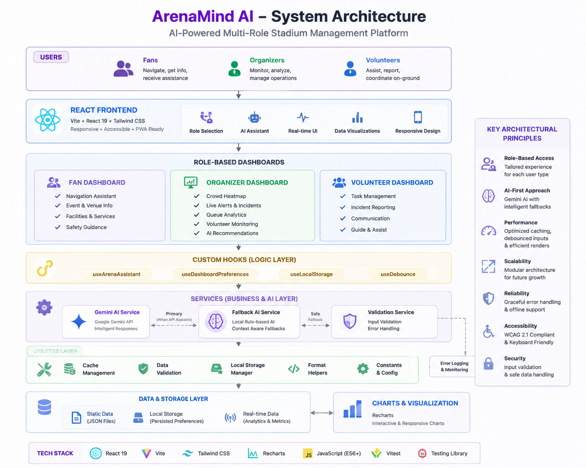

# Architecture

ArenaMind AI is structured as a layered frontend architecture that separates presentation, interaction state, domain data, and AI orchestration. This separation makes the application easier to review, test, and evolve into a larger operational platform.

## High-Level Architecture

```text
User Interaction
  -> React UI layer
      -> Dashboard components
      -> Assistant experience
      -> Shared UI primitives
  -> State and preference hooks
  -> Service layer
      -> Validation utilities
      -> Local FAQ response routing
      -> Gemini gateway
      -> Safe fallback engine
  -> Static venue simulation data
```



## Component Diagram

```text
App
  -> LandingPage
  -> RoleTabs
  -> FanDashboard
  -> OrganizerDashboard
  -> VolunteerDashboard
  -> AIAssistant
      -> useArenaAssistant
      -> geminiService
      -> fallbackResponses
      -> validation utilities
```

## Service Layer

The service layer is intentionally thin and focused on a small set of responsibilities:

- Validation and sanitization of prompt, role, and language inputs
- Local routing for common stadium requests
- Optional Gemini calls for complex prompt handling
- Deterministic fallback generation when remote AI is unavailable
- Response caching for repeated requests in-session

## AI Flow

1. The assistant receives a user prompt and validates it.
2. The request is checked against local response patterns for high-confidence stadium FAQ content.
3. If no local match is found and a Gemini API key is configured, the prompt is sent to the remote model.
4. If the remote model fails, times out, or returns an invalid payload, the system falls back to local venue intelligence.
5. The final response is returned to the UI with a source tag of local, gemini, or fallback.

## Request Lifecycle

A request moves through the application in a predictable order:

1. The user enters a prompt in the AI assistant.
2. The hook layer captures the interaction and updates the local conversation state.
3. The service layer validates the input and chooses the best response strategy.
4. The chosen response is rendered back to the user with accessible status and logging semantics.
5. Repeated prompts can reuse cached results for faster response times.

## Gemini Fallback Flow

```text
User Prompt
  -> Validation
  -> Local FAQ check
  -> If match: return local response
  -> If no match and API key exists: call Gemini
  -> If Gemini fails: use intelligent fallback
  -> Return safe, role-aware response
```

## Data Flow

Dashboards consume structured simulation data from the data layer, including fan services, organizer incident state, volunteer work items, queue analytics, and crowd density information. This creates a reliable demo foundation while leaving clear extensibility points for future live telemetry integration.
