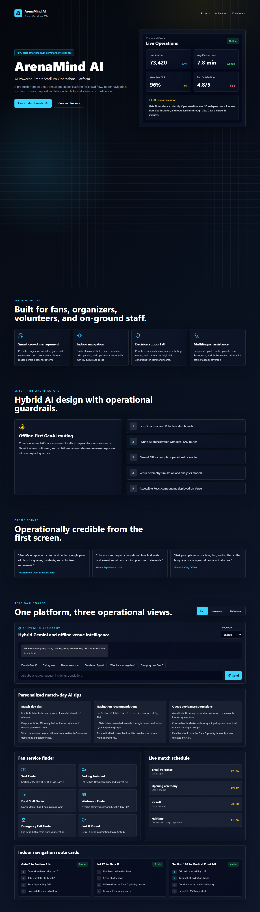
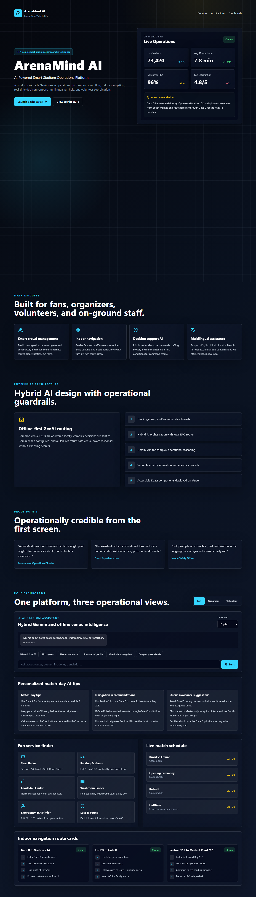
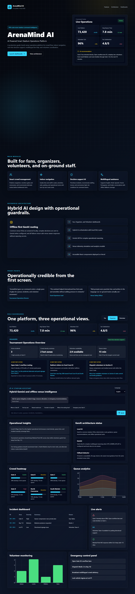
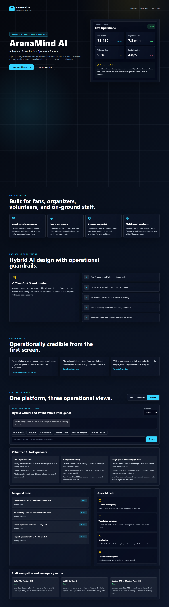
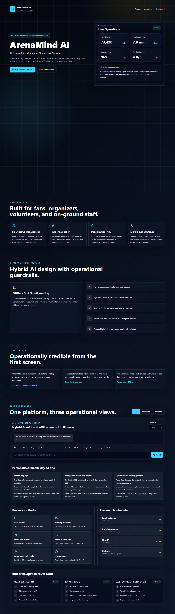
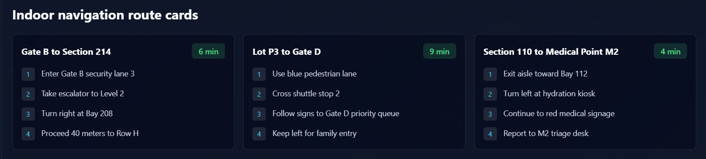
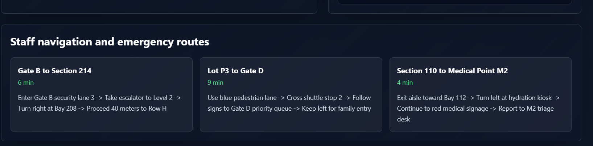
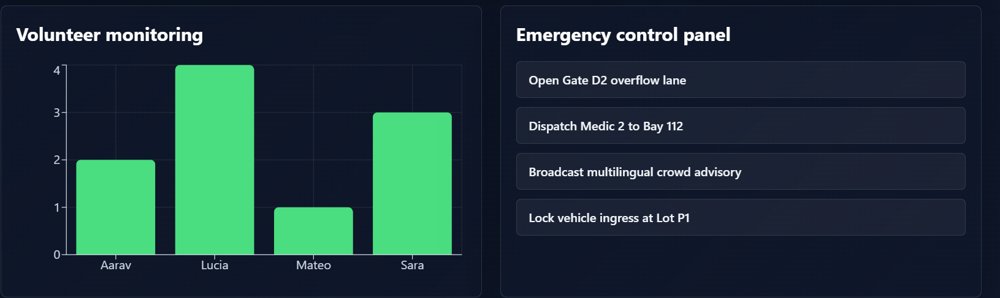
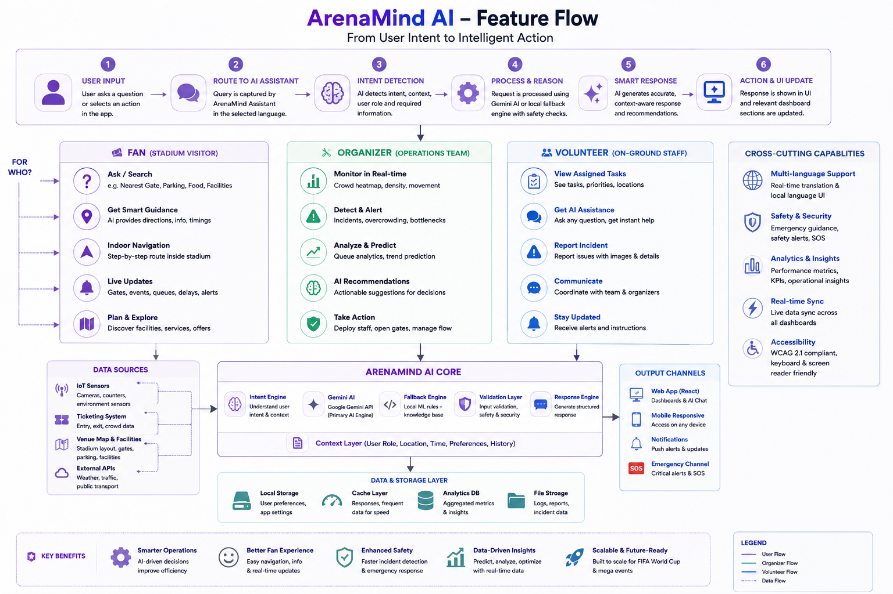

# ArenaMind AI

🚀 Live Demo: https://arena-mind-olive.vercel.app/

📂 Repository: https://github.com/Sandesh2311/ArenaMind

---

## 🏟️ AI-Powered Smart Stadium & Tournament Operations Platform

[](https://vitejs.dev/)
[](https://react.dev/)
[](https://ai.google.dev/)
[](https://vitest.dev/)
[](TESTING.md)
[](LICENSE)

ArenaMind AI is a premium-grade GenAI experience for smart stadium operations, designed for PromptWars Virtual 2026 Main Challenge 4. The platform demonstrates how a role-aware, multilingual assistant can support fans, organizers, volunteers, and on-ground staff during high-pressure live events.


## Project Overview

ArenaMind AI brings together a modern React frontend, a hybrid AI service layer, and simulated venue operations data to deliver intelligent decision support in a stadium environment. The experience is optimized for rapid demo execution, accessibility, and explainable AI behavior while remaining technically credible for larger-scale deployment planning.

## Problem Statement

Modern stadium operations depend on fast, coordinated action across multiple roles during peak events. Operators need to balance crowd flow, queue pressure, incidents, communications, and safety decisions in real time. ArenaMind AI addresses this challenge by presenting role-specific dashboards and a guided AI assistant that can answer common requests locally, escalate complex reasoning to Gemini when available, and fall back safely when the model is unavailable.

## Application Preview

### Hero Experience



### Dashboard Views

| View | Preview |
| --- | --- |
| Fan Dashboard |  |
| Organizer Dashboard |  |
| Volunteer Dashboard |  |

### AI and Operations Experience

| Experience | Preview |
| --- | --- |
| AI Assistant |  |
| Crowd Analytics |  |
| Indoor Navigation |  |
| Emergency Dashboard |  |

## GIF Placeholders

- Role switching
- AI Assistant
- Dashboard navigation

## Architecture

ArenaMind follows a modular, layered architecture built around React components, reusable hooks, service orchestration, validation utilities, and simulation data. This structure keeps the experience readable, testable, and easy to extend for a future production backend.


## System Design

The system is designed to support a single-page, low-latency experience with deterministic behavior for common prompts and graceful degradation for model or network failures. It prioritizes clarity over unnecessary complexity, which is important for a hackathon submission that must be understandable to judges, stakeholders, and future engineering teams.



## AI Architecture

The AI layer uses a hybrid approach:

- Local response matching handles high-confidence, low-risk stadium questions quickly.
- Gemini is invoked only for complex prompts when a valid API key is present.
- Fallback logic ensures that users still receive operationally useful responses during offline or degraded conditions.
- Validation and prompt hardening protect the experience from malformed or injection-like input.

## Folder Structure

```text
src/
  components/         Shared UI, landing page, and dashboards
  components/dashboards/organizer/
                      Organizer-specific analytics sections
  constants/          App-wide configuration and assistant context
  data/               Venue simulation datasets and content
  hooks/              React hooks for assistant and preferences
  services/           AI orchestration and fallback services
  styles/             Tailwind and global styling entry points
  test/               Shared test setup
  utils/              Validation, caching, and pure helpers
```

## Tech Stack

- React 18 + Vite
- Tailwind CSS
- Recharts for analytics visuals
- Lucide icons
- Vitest + React Testing Library + V8 coverage
- ESLint 9 with React hooks rules

## Feature Matrix

| Capability | Fan | Organizer | Volunteer | Staff |
| --- | --- | --- | --- | --- |
| Role-specific dashboard | Yes | Yes | Yes | Partial |
| AI assistant with multilingual support | Yes | Yes | Yes | Yes |
| Queue and crowd guidance | Yes | Yes | Yes | Yes |
| Navigation and route cards | Yes | Partial | Yes | Yes |
| Incident and alert monitoring | Partial | Yes | Yes | Yes |
| Task prioritization and coordination | Partial | Yes | Yes | Yes |
| Offline-safe fallback guidance | Yes | Yes | Yes | Yes |

## Challenge Requirement Mapping

| PromptWars requirement | ArenaMind implementation |
| --- | --- |
| Smart Stadiums | Unified venue operations experience with role-aware dashboards and operational decision support |
| Tournament Operations | Organizer overview cards, incident summaries, queue analytics, and volunteer monitoring |
| GenAI-enabled Architecture | Hybrid local/Gemini AI flow with cache, validation, and deterministic fallback |
| Crowd Management | Heatmap, queue analytics, high-risk recommendations, and crowd guidance |
| Indoor Navigation | Route cards, gate guidance, alternate path suggestions, and emergency routing |
| Real-time Decision Support | AI-generated next actions, operational insights, and live alert summaries |
| Multi-language Assistance | English, Hindi, Spanish, French, Portuguese, and Arabic support |
| Fans | Fan dashboard for services, seating, parking, food, and route planning |
| Organizers | Organizer dashboard for queue and incident oversight |
| Volunteers | Volunteer dashboard for coordination, routing, and translation help |
| On-ground Staff | Staff-facing operational direction and emergency guidance |

## Deployment

ArenaMind is designed for deployment as a Vite-based static web application. The recommended production target is Vercel, with environment variables configured for Gemini access.

## Testing

The project includes a full automated testing workflow covering UI interaction, hooks, validation, AI fallback behavior, and dashboard switching.

## Coverage

Verified results from the current repository state:

- 58 tests passing
- 100% statement coverage
- 98.87% branch coverage

## Accessibility

The interface is documented and implemented with keyboard support, semantic landmarks, labeled controls, live-region announcements, and accessible chart alternatives.

## Security

ArenaMind follows a defensive-by-default approach for prompt handling, input validation, safe fallback behavior, and environment variable usage. Secrets remain out of the browser and client-side storage.

## Performance

The application is optimized for responsiveness by keeping common prompts local, caching repeated AI responses, minimizing blocking model calls, and using lightweight, component-based rendering.

## Future Scope

- Live venue telemetry integration
- Real indoor positioning and geofencing
- Authentication and role-based access control
- Audit logging and incident review workflows
- Expanded multilingual and voice-assisted interaction

## Contributors

ArenaMind AI was developed as a focused submission package for PromptWars and is structured for professional review, iteration, and future scaling.

## License

This project is intended for educational, demo, and hackathon evaluation use. Please review local deployment and usage policies before production adoption.